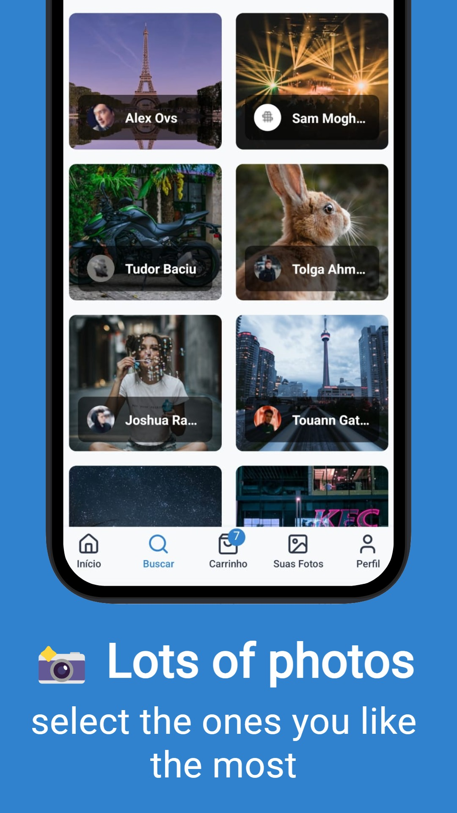
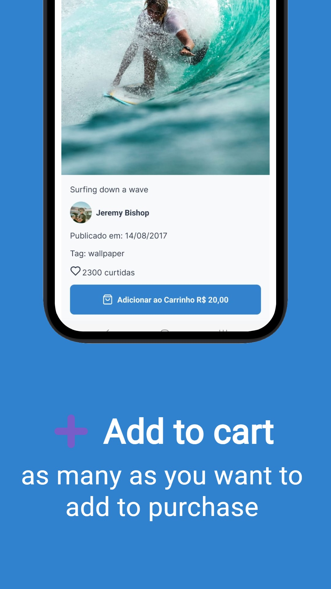
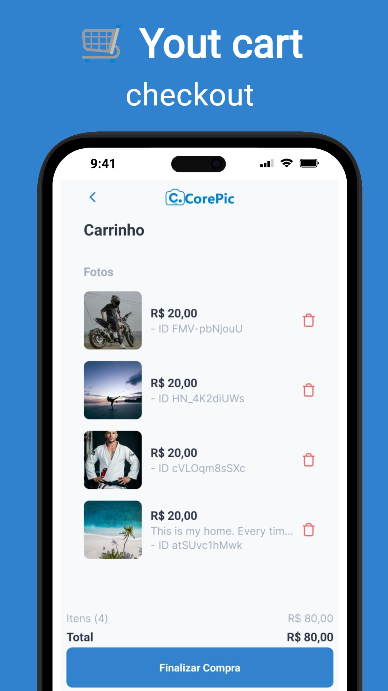

<h1 align="center">
  
</h1>

<p align="center">
  
  
</p>

<p align="center">Find and buy the best photos in the world in a simple and secure way.</p>

<p align="center">
  
  
  
  
</p>

<p align="center">See a preview.</p>

<p align="center">
  
  
</p>

## 📦 Tech Stack

- Expo
- Typescript
- React Navigation
- React Query
- React Hook Form
- Zod
- Firebase
- Lucide React Native
- Styled Components
- Styled System

[check others in package.json](package.json)

## ✨ Key Features

##### 🔐 Authentication
- **SignIn/SignUp** with Firebase Auth
- User session management

##### 🌄 Unsplash Integration
- Advanced image search
- High-resolution preview

##### 🔍 Search System
- Keyword search
- Predefined category browsing
- Popular theme filters

##### 🎨 UI/UX
- Responsive interface
- Dark/Light mode
- Toast notifications
- Loaders and empty states

## 🔐 Example .env File

```bash
# Client
CLIENT=

# App (dev | pro)
BASE=

# Unsplash | unsplash.com/developers
UNSPLASH_APIURL=
UNSPLASH_APIKEY=

# Firebase | console.firebase.google.com
FIREBASE_APIKEY=
FIREBASE_AUTHDOMAIN=
FIREBASE_PROJECTID=
FIREBASE_STORAGEBUCKET=
FIREBASE_MESSAGINGSENDERID=
FIREBASE_APPID=
FIREBASE_MEASUREMENTID=
```

.env is not being ignored in .gitignore for testing with test credentials.

Credentials will be disabled soon.

## 📂 Project Structure

Here is the project directory structure:

```bash
src  
├── assets  
│   ├── google.png  
│   ├── hero.png  
│   ├── logo.png  
│   └── simple-logo.png  
│  
├── components  
│   ├── index.ts  
│   ├── common  
│   │   ├── index.ts  
│   │   ├── conditional  
│   │   │   ├── data.ts  
│   │   │   └── index.tsx  
│   │   └── spinner  
│   │       └── index.tsx  
│   └── ui  
│       ├── index.ts  
│       ├── button  
│       │   ├── data.ts  
│       │   ├── index.tsx  
│       │   └── layout  
│       │       ├── index.tsx  
│       │       └── styles.ts  
│       ├── header  
│       │   ├── data.ts  
│       │   ├── index.tsx  
│       │   └── layout  
│       │       └── index.tsx  
│       ├── input  
│       │   ├── data.ts  
│       │   ├── index.tsx  
│       │   └── layout  
│       │       ├── index.tsx  
│       │       └── styles.ts  
│       ├── text  
│       │   ├── data.ts  
│       │   ├── index.tsx  
│       │   └── layout  
│       │       ├── index.tsx  
│       │       └── styles.ts  
│       ├── toast  
│       │   ├── data.ts  
│       │   ├── index.tsx  
│       │   └── layout  
│       │       └── styles.ts  
│       └── wrapped  
│           ├── data.ts  
│           ├── index.tsx  
│           └── layout  
│               ├── index.tsx  
│               └── styles.ts  
│  
├── configs  
│   └── firebase  
│       └── index.ts  
│  
├── contexts  
│   ├── auth.tsx  
│   ├── cart.tsx  
│   ├── theme.tsx  
│   ├── toast.tsx  
│   └── interfaces  
│       ├── auth.ts  
│       ├── cart.tsx  
│       ├── theme.ts  
│       └── toast.ts  
│  
├── hooks  
│   ├── index.ts  
│   └── use-firebase-error.ts  
│  
├── providers  
│   └── app-providers.tsx  
│  
├── routes  
│   ├── app.routes.tsx  
│   ├── app.tabs.routes.tsx  
│   ├── auth.routes.tsx  
│   └── index.tsx  
│  
├── screens  
│   ├── app  
│   │   ├── picture-detail  
│   │   │   ├── data.ts  
│   │   │   ├── index.tsx  
│   │   │   └── layout  
│   │   │       └── index.tsx  
│   │   └── tabs  
│   │       ├── cart  
│   │       │   ├── data.ts  
│   │       │   ├── index.tsx  
│   │       │   └── layout  
│   │       │       ├── empty.tsx  
│   │       │       └── index.tsx  
│   │       ├── home  
│   │       │   ├── data.ts  
│   │       │   ├── index.tsx  
│   │       │   └── layout  
│   │       │       ├── category-list.tsx  
│   │       │       └── index.tsx  
│   │       ├── my-pictures  
│   │       │   ├── data.ts  
│   │       │   ├── index.tsx  
│   │       │   └── layout  
│   │       │       ├── empty.tsx  
│   │       │       └── index.tsx  
│   │       ├── profile  
│   │       │   ├── data.ts  
│   │       │   ├── index.tsx  
│   │       │   └── layout  
│   │       │       └── index.tsx  
│   │       └── search  
│   │           ├── data.ts  
│   │           ├── index.tsx  
│   │           └── layout  
│   │               ├── empty.tsx  
│   │               └── index.tsx  
│   └── auth  
│       ├── sign-in  
│       │   ├── data.ts  
│       │   ├── index.tsx  
│       │   ├── schema.ts  
│       │   └── layout  
│       │       └── index.tsx  
│       ├── sign-up  
│       │   ├── data.ts  
│       │   ├── index.tsx  
│       │   ├── schema.ts  
│       │   └── layout  
│       │       └── index.tsx  
│       └── welcome  
│           ├── data.ts  
│           ├── index.tsx  
│           └── layout  
│               └── index.tsx  
│  
├── services  
│   └── api  
│       ├── images.ts  
│       ├── sign-in.ts  
│       ├── sign-up.ts  
│       └── interfaces  
│           ├── images.ts  
│           ├── sign-in.ts  
│           └── sign-up.ts  
│  
├── themes  
│   ├── index.tsx  
│   └── tokens.tsx  
│  
└── types  
    ├── png.d.ts  
    └── styled.d.ts  
```

## 🎨 Design Tokens

This project uses the following design tokens for consistent styling across the application.

### 🌈 Colors

##### Light Theme
- **transparent**: transparent  
- **background**:  `#F8F9FA`
- **text**:  `#2D3748`
- **primary**:  `#3182CE`
- **secondary**:  `#ED64A6`
- **border**:  `#d6dce4`
- **success**:  `#48BB78`
- **error**:  `#F56565`
- **warning**:  `#ECC94B`
- **info**:  `#4299E1`
- **buttonText**:  `#FFFFFF`
- **placeholder**:  `#A0AEC0`

##### Dark Theme
- **transparent**: transparent  
- **background**:  `#1A202C`
- **text**:  `#E2E8F0`
- **primary**:  `#63B3ED`
- **secondary**:  `#F687B3`
- **border**:  `#4A5568`
- **success**:  `#68D391`
- **error**:  `#FC8181`
- **warning**:  `#F6E05E`
- **info**:  `#46a5f3`
- **buttonText**:  `#1A202C`
- **placeholder**:  `#A0AEC0`

##### 📝 Fonts
- **primary**: Inter_400Regular
- **primaryBold**: Inter_700Bold
- **secondary**: Arial

##### 🔢 Font Sizes
- **xsmall**: 12px
- **small**: 14px
- **medium**: 16px
- **large**: 18px
- **xlarge**: 24px
- **xxlarge**: 32px

##### 📏 Spacing
- **xsmall**: 4px
- **small**: 8px
- **medium**: 16px
- **large**: 24px
- **xlarge**: 32px

##### 🔲 Border Radius
- **small**: 4px
- **medium**: 8px
- **large**: 12px

##### 💨 Box Shadow
- **small**: 0 2px 4px rgba(0, 0, 0, 0.1)
- **medium**: 0 4px 8px rgba(0, 0, 0, 0.1)
- **large**: 0 8px 16px rgba(0, 0, 0, 0.2)

## 🔩 Installation

To install and run the project locally, follow these steps:

1. Install [**Yarn**](https://yarnpkg.com/) on your computer
1. Clone the repository: `git clone https://github.com/jhonbergmann/corepic.git`
1. Navigate to the project directory: `cd corepic`
1. Install the dependencies: `yarn`

## ⚙️ Usage

1. Start the development server: `npx expo start`
1. Read the QR Code with the Expo Go app
